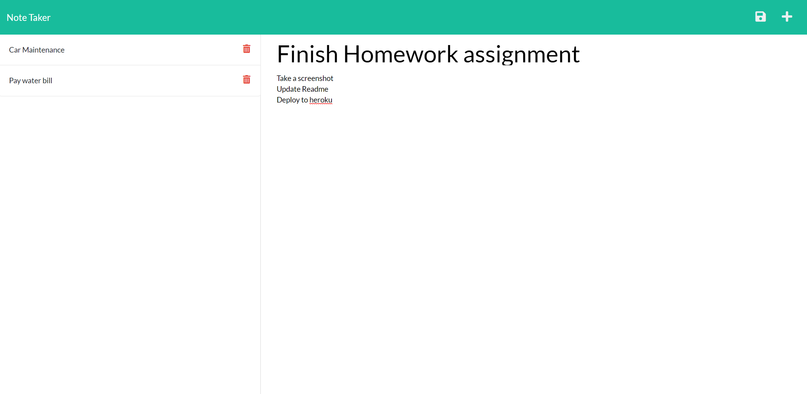

# My_Notes
* My Notes is an app that allows you to save and recall notes and tasks from a simple list.

## Table of Contents

1. [Description](#description)

1. [Screenshot](#screenshot)

1. [Installation](#installation)

1. [Usage](#usage)

1. [Contributing](#contributing)

1. [Collaborators](#collaborators)

1. [Questions](#questions)

1. [Example HTML file](#sample)

## Description

* This application allows you to to enter a task title and description of your reminder.  When clicking the save icon at the upper right, it populates your information on a list to the left.  The task details can be recalled by clicking on the item on the list.  The plus sign to the upper right will enable you to enter a new note and the delete icon will remove a note when completed.

## Screenshot

## Installation

* Run the following to install dependancies, express is the only module to be installed

> npm i

## Usage

* The repo can be forked and then the required modules installed.  The entry point of the application is server.js.  Accessed by enterting "node server.js" from the command line.

## Contributing

* The project is finished and not considering contributions at the moment.

## Collaborators

* sole author

## Questions

* If you would like, you can connect with me thru my github profile [Github Profile](https://github.com/stevenslade)

## Deployed Version

* [My Notes on Heroku](https://salty-brushlands-66923.herokuapp.com/)

